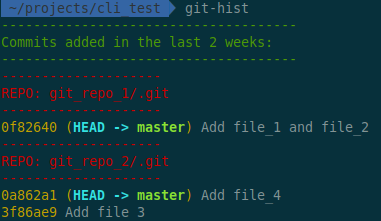

# cli_tools
# Git commit history for multiple repositories
I often use `git log` to remind myself of the last commits I added to my code. In many cases, I have to checkout more than repo to get the full picture of where I left off. In fact, this happens so often that I decided to write a small, neat shell script that I can call with a simple `git-hist` which traverses all git repos in a directory and displays the latest commits.

# Example
Imagine the following folder structure.
```
projects    
│
└───git_repo_1
│   │   file_1.txt
│   │   file_2.txt
│   
└───git_repo_2 
    │   file_3.txt
    │   file_4.txt
```
An exemplary output of `git-hist` looks like this:




# Installation
To use the script, simply clone the repo:

```
git clone git@github.com:matsmaiwald/cli_tools.git
```

and add it to your Path by adding the following line to your `~/.zshrc` or `~/.bashrc`:

```
export PATH=$PATH:<path to cli_tools repo>
```

